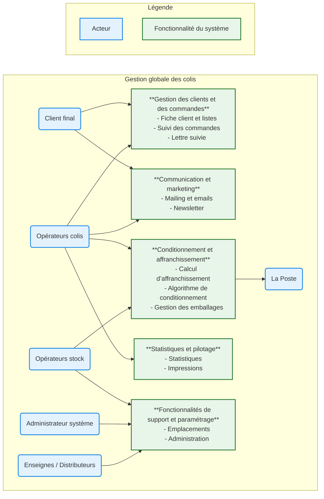
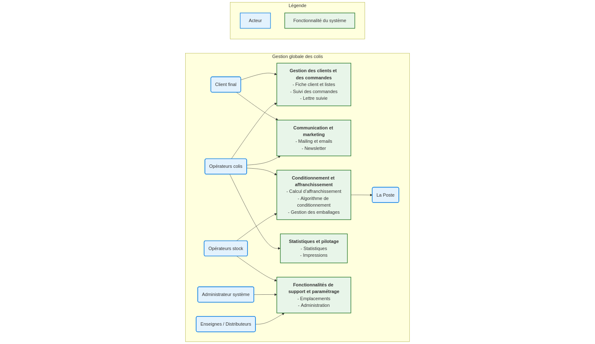
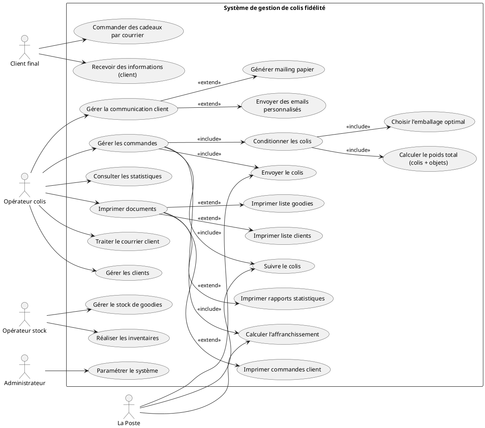
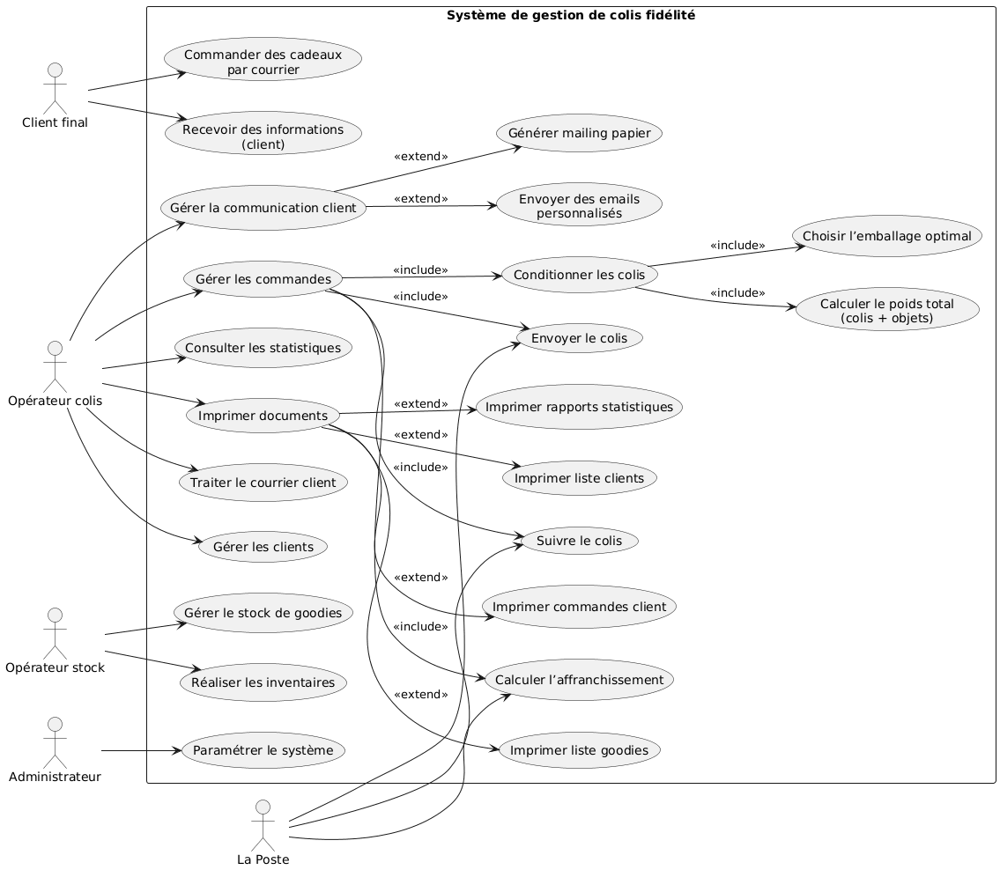
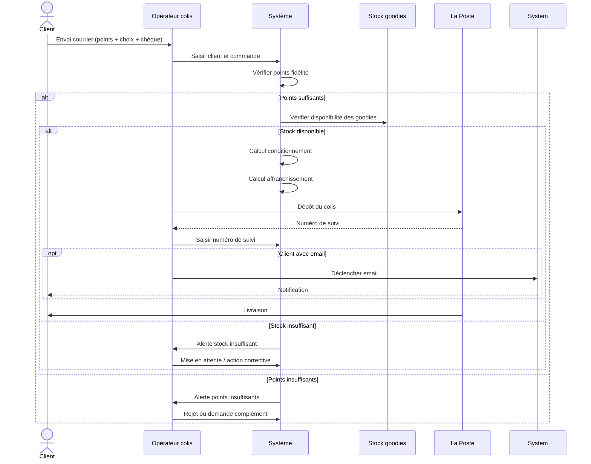
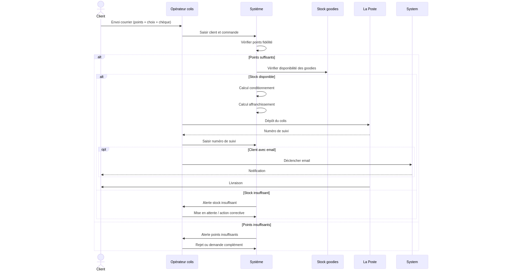
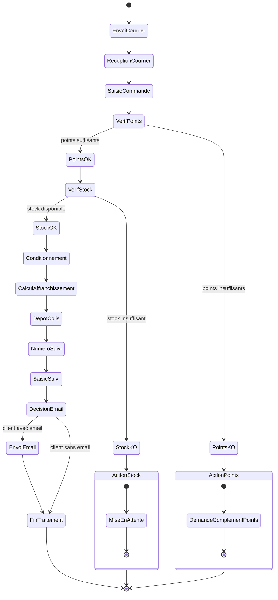
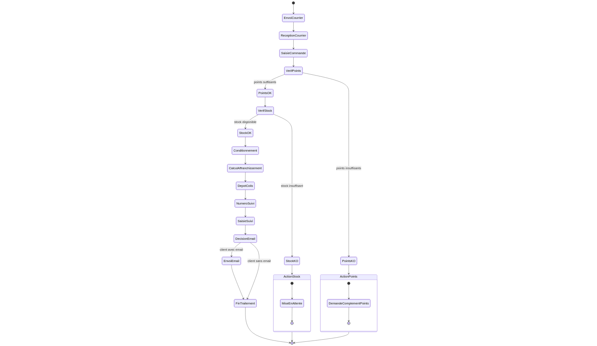
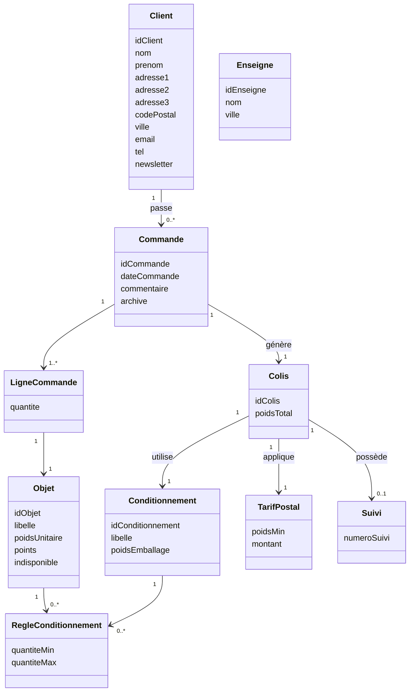
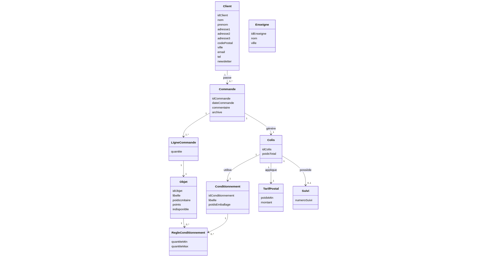

# _Déterminer les acteurs et décrire leurs rôles respectifs._

## Acteurs internes (utilisateurs du système)

- **Opérateurs colis** :Ils traitent manuellement les courriers reçus, gèrent les clients, les commandes, le conditionnement, l'envoi d'emails personnalisés et les statistiques
- **Opérateurs stock** : Ils sont chargés de la gestion des stocks de « goodies » (cadeaux) et de la réalisation des inventaires
- **Administrateur du système** : Il est responsable du paramétrage de l'application. Ses tâches incluent la gestion des listes d'emballages, la configuration des données pour le calcul des frais d'affranchissement et la mise à jour des poids des articles

## Acteurs externes (utilisateurs du système)

- **Client final (particulier)** : Il initie le processus en collectant les points de fidélité sur les emballages, en consultant le site vitrine pour choisir ses cadeaux et en envoyant sa demande (points, chèque, choix des cadeaux) par courrier à la fromagerie
- **La Poste** : Il s'agit du partenaire externe exclusif pour l'envoi des colis, il permet la gestion des tarifs.
- **Enseignes / Grands distributeurs** : Dans le futur, il pourront etre utilisés pour les statistiques des ventes et le nombre de clients collectant des points.

# _Réaliser un schéma global de l’architecture du système (acteurs et grandes fonctionnalités) avec les interactions des acteurs._

## grandes fonctionnalités

1. Gestion des clients
2. Gestion des commandes & colis
3. Gestion du conditionnement & affranchissement
4. Gestion des stocks
5. Administration du système
6. Communication & reporting

## schéma

# _Représenter les acteurs et le système sous forme de diagrammes de UCs_

# Décrire (textuellement) le scénario de la gestion des colis et le représenter à l’aide des diagrammes de séquence et d’activité.

## Description
Le scénario de la gestion des colis au sein de la fromagerie DIGICHEESE suit un processus précis, allant de la réception de la demande du client jusqu'au suivi de l'expédition. Voici les étapes textuelles de ce scénario :
1. Initialisation par le client
Le processus débute hors système : le client final collecte ses points de fidélité, choisit ses cadeaux (« goodies ») sur le site vitrine et envoie par courrier postal son dossier comprenant les points, le chèque de règlement des frais de port et sa liste de cadeaux
.
2. Réception et Saisie de la commande
À la réception du courrier, un opérateur colis traite la demande manuellement
. Il utilise l'application pour :
• Rechercher ou créer la fiche client (nom, adresse, code postal et ville sont obligatoires)
.
• Saisir la commande en sélectionnant les objets demandés par le client
.
3. Détermination du conditionnement et calcul des frais
Une fois les articles saisis, le système intervient pour la partie logistique :
• Algorithme de conditionnement : L'application s'appuie sur un calcul complexe (utilisant les quantités minimales et maximales paramétrées par l'administrateur) pour identifier automatiquement le meilleur emballage adapté à la commande
.
• Calcul d'affranchissement : Le système calcule automatiquement le montant des frais de port en combinant le poids total (articles + emballage choisi) et les tarifs postaux de La Poste mis à jour annuellement
.
4. Expédition et Suivi (Lettre Suivie)
Le colis est ensuite confié à La Poste pour l'envoi physique
.
• Numéro de suivi : Au moment du dépôt, La Poste fournit un numéro de suivi
.
• Mise à jour du système : L'opérateur reporte manuellement ce numéro dans la zone « commentaires » de la commande dans l'application
.
5. Communication et Clôture
• Notification client : Si le client a renseigné une adresse électronique, l'opérateur déclenche manuellement l'envoi d'un email personnalisé
.
• Mailing papier : Pour les clients sans email, le système peut générer un fichier texte pour une procédure de mailing papier
.
• Historisation : Le mouvement du colis est enregistré dans l'historique des commandes, ce qui permet ultérieurement à la direction de consulter des statistiques d'activité
.

## Diagramme de séquence

## Diagramme d'activité

# Créer le diagramme de classe permettant de réaliser la partie gestion des colis (recueillir les data nécessaires pour le réaliser).

